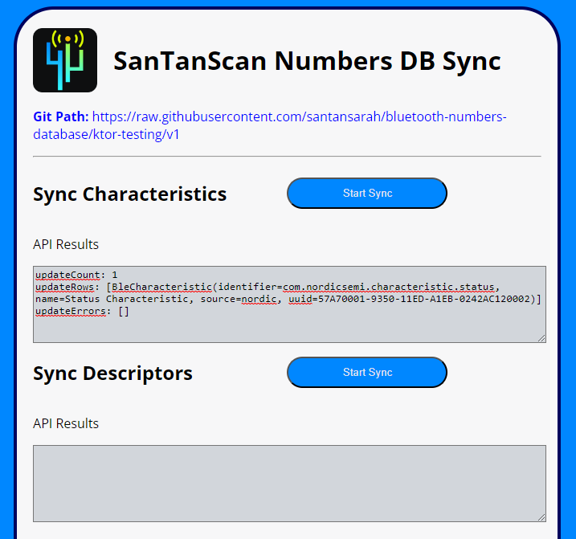

# Kotlin React Ktor JS Multiplatform with kotlin-emotion

My [BLE Scanner & Debugger](https://github.com/santansarah/ble-scanner) is now live on the Google Play Store.

This app uses a pre-populated Room database that includes imported BLE Services, Characteristics, and Descriptors
information from Nordic's [Bluetooth Numbers Database](https://github.com/NordicSemiconductor/bluetooth-numbers-database).

Nordic's database might be updated from time to time, and I wanted a way to easily update my SQLite data without having
to manually recreate my database every time. To accomplish that, I created a Kotlin/JS/React/Ktor Multiplatform app 
that does the following when you click `Start Sync`:

1. From the frontend, it calls a Ktor API path to `/descriptors`, using Ktor Http Client for JS.
2. From the API, it goes out to GitHub and reads the Raw JSON, using Ktor Http Client CIO.
3. Next, the API converts the Raw JSON to an object.
4. Using Exposed, the API then reads the existing data from the SQLite database, and creates a list of 
   all **new** Descriptors.
5. If there are new records, the API inserts new Descriptors into the SQLite table.
6. Finally, the API returns the response to the React frontend.

